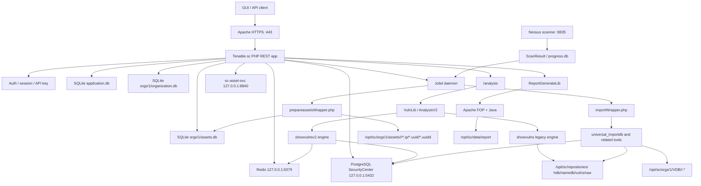

# Mapa Interno Tenable.sc 6.8 Lab

## Lectura Ejecutiva

El laboratorio actual es una instalacion Tenable.sc 6.8 dentro del contenedor
`tenablesc-labbox-ol8`, con un scanner Nessus externo vinculado como
`nessus_8835`. La pieza clave es que no debe interpretarse como un producto
"solo PostgreSQL": el contenedor tuvo vida previa en una version 6.6, donde
SQLite seguia siendo la base principal de muchas areas. En 6.8 aparece
PostgreSQL como plano moderno para findings, assets normalizados, plugins y
colas, pero siguen existiendo SQLite locales para configuracion de aplicacion,
organizacion, assets, plantillas, scans, audits, queries, estado legado y bases
temporales/per-scan.

Conclusion operativa: la presencia de SQLite no es por si sola un fallo. El
fallo aparece cuando alguna relacion entre esos planos queda rota: PostgreSQL no
acepta conexiones, Redis no esta arriba, los artefactos internos de Asset Lists
no existen, Jobd no procesa, el importador no escribe repositorios/VDB, o el
motor de analysis no puede resolver UUID/IP contra el repositorio.

## Alcance Y Fuentes

Este mapa combina tres tipos de fuente:

- Evidencia local del contenedor: procesos, rutas, bases, logs y codigo bajo
  `/opt/sc`.
- API publica de Tenable.sc: `/analysis`, `/asset`, `/auditFile`,
  `/scanResult`, `/scanner`, `/repository`, `/status`.
- Documentacion oficial enlazada en `agents.md` y en este directorio.

La API oficial confirma la superficie soportada: `/analysis` procesa queries,
`/asset` expone Asset Lists y expansiones, `/auditFile` permite listar, crear y
parchear audit files, `/scanResult` muestra estado de importacion, `/scanner`
expone el scanner vinculado, `/repository` gestiona repositorios, y `/status`
resume salud visible como `jobd`, licencia, migracion y feeds.

## Diagrama De Relaciones



## Capas Principales

| Capa | Elementos | Funcion | Salud minima |
| --- | --- | --- | --- |
| Arranque Docker | `/start.sh`, `/running.sh`, `supervisord` | Levantar el labbox, aplicar config, iniciar Apache y Jobd | Contenedor Up, `/dev/shm >= 1GB`, supervisor con Apache y Jobd en RUNNING |
| Web/API | Apache, PHP, `/rest/*` | GUI y API REST soportada | `https://localhost:8443`, `/rest/status` responde aunque sea `Invalid token` sin auth |
| Jobs | Jobd, `jobqueue.jobqueue`, wrappers PHP | Importar scans, preparar assets, tareas diferidas | Jobd RUNNING, cola sin bloqueos permanentes |
| PostgreSQL | `/opt/sc/data/postgresql`, DB `SecurityCenter` | Findings modernos, assets normalizados, plugins, xrefs y jobqueue en 6.8 | `select 1` OK, tablas clave pobladas, logs sin refused recientes |
| SQLite local/legado | `application.db`, `organization.db`, `assets.db`, `jobqueue.db`, `tvdb.db`, progress/VDB DBs | Configuracion, organizacion, scans, audits, Asset Lists, estado heredado y bases temporales | Version 6.8 en `application.db`, tablas esperadas accesibles readonly |
| Repositorios binarios | `/opt/sc/repositories/<id>` | Acumulado, patched, namedb, raw y vulns por repositorio | Ficheros clave presentes y no corruptos en repos con datos |
| Asset artifacts | `/opt/sc/orgs/1/assets/<group>/<repo>` | Listas materializadas por IP/UUID para filtros de analysis | `*.uuidd` presentes en repos universal; ejecutar prepareassets si faltan |
| Redis | `/opt/sc/data/redis` | Cache de analysis y servicios internos | `redis-cli ping` devuelve `PONG` |
| Microservicios | `microservice-supervisor.sh`, `sc-asset-svc` | Servicio interno de assets en puerto 8840 | Proceso vivo y HTTP responde, aunque pida autorizacion |
| Analysis | `Analysis.php`, `AnalysisV2.php`, `VulnLib.php`, `showvulns`, `showvulnsv2` | Consultas de vulnerabilidades/compliance | `/analysis` con `sourceType=cumulative` y filtros de asset funciona |
| Scans/import | `ScanResult`, `progress.db`, `importWrapper.php`, `universal_importdb` | Convertir resultados Nessus en repositorios, VDB y DB moderna | ScanResult pasa a Completed/Finished, sin `importStatus=Error` |
| Reportes | `ReportGenerateLib.php`, `/opt/sc/fop`, Java, `/opt/sc/data/report` | Generar PDF/HTML/CSV segun reporting | `SC_ROOT=/opt/sc /opt/sc/fop/fop` devuelve comando Java |
| Logs | `/opt/sc/admin/logs`, `/opt/sc/support/logs` | Evidencia de fallos reales | Sin errores recientes de Postgres/Redis/UUID/WebSocket/import |

## PostgreSQL Y SQLite

### PostgreSQL en 6.8

En el laboratorio inspeccionado, PostgreSQL vive en:

- Datos: `/opt/sc/data/postgresql`
- Base: `SecurityCenter`
- Usuario local: `tns`
- Host/puerto interno: `127.0.0.1:5432`
- Config relevante: `listen_addresses='127.0.0.1'`, `port=5432`

Tablas observadas de interes:

- `public.asset`
- `public.finding_nessus`
- `public.finding_nessus_output`
- `public.plugin`
- `public.pluginxref`
- `public.xref`
- `jobqueue.jobqueue`

Uso interpretado:

- `plugin`, `pluginxref`, `xref`: catalogo y referencias de plugins.
- `asset`: representacion moderna por repositorio/host.
- `finding_nessus`: findings normalizados.
- `finding_nessus_output`: salida asociada al finding.
- `jobqueue.jobqueue`: cola moderna de trabajos.

### SQLite que sigue siendo esperado

SQLite no se debe borrar ni considerar error automatico:

- `/opt/sc/application.db`: version, repositorios, scanners, plantillas globales.
- `/opt/sc/orgs/1/organization.db`: scans, scan results, policies, audit files,
  reports, queries y relaciones policy-audit.
- `/opt/sc/orgs/1/assets.db`: definicion de Asset Lists, clausulas, IP counts y
  materializacion logica previa a ficheros.
- `/opt/sc/jobqueue.db`: cola/local legacy. En 6.8 puede quedar como estructura
  heredada, mientras `jobqueue.jobqueue` existe en PostgreSQL.
- `/opt/sc/data/scans/<job>/progress.db`: progreso por job de scan.
- `/opt/sc/orgs/1/VDB/<date>/<scanResult>.*.db`: bases de resultados
  individuales/trending por scan result.

Lectura correcta para este Docker: fue 6.6 y ahora es 6.8. Por tanto, estamos
viendo una instalacion migrada con dos planos. El doctor debe comprobar ambos,
no solo PostgreSQL.

## Flujo De Scan A Analysis

1. El usuario lanza un scan desde GUI/API.
2. Tenable.sc usa la definicion del scan en `organization.db` y el scanner en
   `application.db`.
3. Nessus ejecuta y devuelve resultados al job.
4. Durante ejecucion se usa `/opt/sc/data/scans/<job>/progress.db`.
5. Jobd ejecuta `importWrapper.php`.
6. El importador llama herramientas como `universal_importdb`.
7. Se actualizan repositorios en `/opt/sc/repositories/<repo>`.
8. Se generan artefactos VDB en `/opt/sc/orgs/1/VDB/<date>/`.
9. En 6.8 tambien se sincronizan findings/assets/plugins relevantes hacia
   PostgreSQL.
10. `/analysis` lee contra el acumulado `cumulative`, usando motor legacy
    `showvulns` y/o `showvulnsv2` segun repo, tool, filtros y capacidades.

Punto critico ya observado: si PostgreSQL esta caido durante importacion, el
scan puede terminar en Tenable/Nessus pero fallar al importar con errores de
conexion a `127.0.0.1:5432`.

## Flujo De Asset List A Filtro `/analysis`

1. La definicion logica del asset vive en `orgs/1/assets.db`.
2. Tenable.sc calcula conteos por repositorio en `AssetIPCount`.
3. `prepareassetsWrapper.php` materializa ficheros en
   `/opt/sc/orgs/1/assets/<group>/<repo>/`.
4. Para repositorios universal, el filtro por asset necesita ficheros UUID,
   especialmente `*.uuidd`.
5. `/analysis` genera comandos internos `showvulns` con `+asset "<id>"`.
6. Si falta el fichero esperado, aparece el error:
   `Error loading uuid file into UUID list ... No such file or directory`.

Repair asociado:

```powershell
python laboratorio\build_lab.py repair --case assets --repositories 6,8,9,10
```

## Analysis Y Motores Internos

La API soportada es `/rest/analysis`. Para este proyecto la query valida es:

- `type=vuln`
- `sourceType=cumulative`
- `pluginType=compliance`
- filtros por `assetID`, `repositoryIDs` y, cuando aplique, `auditFileID`

Internamente se observaron dos caminos:

- `showvulns`: motor historico que lee ficheros de repositorio y VDB.
- `showvulnsv2`: motor Go moderno que puede apoyarse en PostgreSQL/Redis.

La existencia de ambos explica diferencias de paridad observables en logs
(`showvulns` frente a `goVulns`) y por que conviene validar `/analysis` desde la
API, no solo mirar tablas PostgreSQL.

## Reportes PDF

Los reportes usan:

- `ReportGenerateLib.php`
- XML/XSL bajo `/opt/sc/data/report`
- Apache FOP en `/opt/sc/fop`
- Java del sistema

Check minimo:

```bash
SC_ROOT=/opt/sc /opt/sc/fop/fop
```

Debe devolver una invocacion Java. Sin `SC_ROOT`, el wrapper puede buscar rutas
incorrectas y fallar aunque FOP este instalado.

## Tabla De Salud

| Check | Comando base | Esperado | Si falla |
| --- | --- | --- | --- |
| Contenedor | `docker ps` | `tenablesc-labbox-ol8` Up | `build_lab.py up` |
| Memoria compartida | `docker inspect` | `ShmSize >= 1073741824` | Recrear con compose canonico |
| Supervisor | `supervisorctl -c /etc/supervisord-tenablesc.conf status` | Apache y Jobd RUNNING | `repair --case runtime` |
| PostgreSQL | `psql ... -c 'select 1'` | `1` | `repair --case postgres` |
| Redis | `redis-cli ping` | `PONG` | `repair --case runtime` |
| Web/API | `curl -k https://127.0.0.1/rest/status` | HTTP responde | revisar Apache/PHP |
| WebSocket | `pgrep -af WebSocketServer.php` | proceso vivo | `repair --case runtime` |
| Asset service | `curl http://127.0.0.1:8840/` | HTTP responde pidiendo auth | `repair --case runtime` |
| Asset artifacts | `find /opt/sc/orgs/1/assets -name '*.uuidd'` | ficheros presentes | `repair --case assets` |
| Repositorios | `find /opt/sc/repositories -name '*.db' -o -name '*.raw'` | ficheros no vacios en repos con datos | revisar importaciones |
| Scan results | API `/scanResult` o `organization.db` | `Completed/Finished` sin error recurrente | revisar Jobd/import logs |
| Reports | `SC_ROOT=/opt/sc /opt/sc/fop/fop` | comando Java | revisar Java/FOP/rutas |
| Logs | grep de errores recientes | sin refused/uuid/import nuevos | clasificar incidencia |

## Incidencias Conocidas Del Laboratorio

| Sintoma | Causa local probable | Reparacion |
| --- | --- | --- |
| `Error opening postgres DB ... Connection refused` en import | PostgreSQL no estaba arrancado o `/dev/shm` era insuficiente | `repair --case postgres`; si `/dev/shm` pequeno, recrear |
| GUI/API dice Asset Lists `Calculating` | Artefactos internos no materializados | `repair --case assets` |
| `/analysis` falla con `Error loading uuid file` | Falta `*.uuid` o `*.uuidd` para repo/grupo/asset | `repair --case assets` |
| Apache log con `127.0.0.1:9080 refused` | WebSocket no estaba levantado | `repair --case runtime` |
| Redis connection refused al limpiar cache | Redis no estaba levantado | `repair --case runtime` |
| FOP falla buscando `/fop/conf/fop_opts` | Se ejecuto sin `SC_ROOT=/opt/sc` | ejecutar con `SC_ROOT` |

## Evidencia Actual Del Lab

Evidencia generada con `inspect_tenablesc_internals.py` el 2026-05-23:

- Supervisor: Apache y Jobd en RUNNING.
- PostgreSQL: responde `select 1`; schemas `public` y `jobqueue` visibles.
- Redis: responde `PONG`.
- API: `/rest/status` responde sin autenticacion con error de token esperado.
- `sc-asset-svc`: responde por HTTP en `127.0.0.1:8840` pidiendo autorizacion.
- FOP/Java: wrapper disponible con `SC_ROOT=/opt/sc`.
- SQLite `application.db`: version `6.8.0`.
- Repositorios en `application.db`: 8 (`Default`, `Default (IP)`, `Agents`,
  `IS`, `Tenable.OT`, `Manual Audit`, `Default`, `compliance`), todos con
  `dataFormat=universal` en la evidencia actual.
- PostgreSQL: `public.asset=913`, `public.finding_nessus=20`,
  `public.finding_nessus_output=20`, `public.plugin=332751`,
  `public.pluginxref=1728523`, `jobqueue.jobqueue=0`.
- Artefactos de Asset Lists: 1854 ficheros, con extensiones `.ip`, `.ipd` y
  `.uuidd`; la presencia de `.uuidd` confirma que el repair de assets dejo
  materializacion para repos universal.

La evidencia JSON esta en `laboratorio/tenablesc_internals/evidence/current_report.json`.

## Comando De Inspeccion Profunda

```powershell
python laboratorio\tenablesc_internals\inspect_tenablesc_internals.py `
  --pretty `
  --output laboratorio\tenablesc_internals\evidence\current_report.json `
  --quiet
```

El JSON resultante debe revisarse antes de versionarse. Aunque el inspector
redacta patrones sensibles, puede incluir nombres de scans, IPs y rutas de
laboratorio.

## Uso En El Extractor

Para el extractor de compliance no se debe depender de rutas internas. Estas
rutas solo sirven para:

- Diagnosticar laboratorio.
- Explicar errores de `/analysis`.
- Reparar materializacion de assets.
- Comprobar importaciones y salud de servicios.
- Investigar hipotesis sobre `.audit` cuando la API no da visibilidad suficiente.

Contrato que sigue siendo valido para Fase 1:

- Query via API REST `/analysis`.
- `sourceType=cumulative`.
- Agrupacion por Asset Lists.
- Fallback por IP si un Asset List no puede usarse por `assetID`.
- Uso de `/auditFile` por API para conservar `auditFile.id` cuando se parchea un
  `.audit`.

## Fuentes Oficiales Consultadas

- Tenable.sc API Overview: https://docs.tenable.com/security-center/api/index.htm
- Tenable.sc Analysis API: https://docs.tenable.com/security-center/api/Analysis.htm
- Tenable.sc Asset API: https://docs.tenable.com/security-center/api/Asset.htm
- Tenable.sc AuditFile API: https://docs.tenable.com/security-center/api/AuditFile.htm
- Tenable.sc Scan Result API: https://docs.tenable.com/security-center/api/Scan-Result.htm
- Tenable.sc Scanner API: https://docs.tenable.com/security-center/api/Scanner.htm
- Tenable.sc Repository API: https://docs.tenable.com/security-center/api/Repository.htm
- Tenable.sc Status API: https://docs.tenable.com/security-center/api/Status.htm

## Preguntas Abiertas

1. Confirmar con scans repetidos si cambiar solo `reference` en un `.audit`
   mantiene identidad de control en Tenable.sc igual que la evidencia inicial en
   Tenable IO.
2. Confirmar si todos los repositorios de produccion seran universal y si
   `showvulnsv2` cubrira las tools necesarias para Fase 1A/1B.
3. Definir que logs internos se pueden conservar como evidencia versionada sin
   exponer datos de cliente cuando el laboratorio pase a produccion.
4. Decidir si el `doctor` debe incorporar algunos checks profundos de este
   inspector o mantenerlos separados por coste/ruido.
